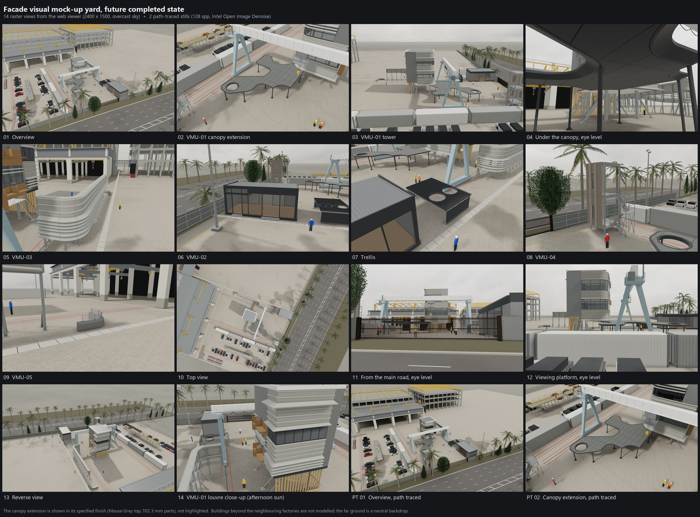

# Facade visual mock-up yard: future completed state


This is a browser-based 3D model of five facade visual mock-ups (VMU-01 to VMU-05) standing in a precast yard. It shows
the yard as it will look once all five mock-ups are complete, including the VMU-01 canopy extension. The geometry comes
from CAD and shop-drawing data. Mock-up finishes use a shared colour table; some yard materials use GLB or procedural
defaults. You can explore the model in real time in
the web viewer, or render path-traced stills from it.

## What is in the model

- **Mock-ups.** The model contains:
  - the VMU-01 tower, with its canopy and the canopy extension;
  - the curved VMU-03, and VMU-02, VMU-04 and VMU-05;
  - a trellis;
  - the yard around them: ground slab, drains, crane runways, gantry crane, sheds, containers, hoarding, viewing
    platform and high masts, with a generic main road and roadside planting outside the hoarding.
- **Size.** Seven glTF files hold 2,223,601 triangles. The same model is also provided as a Rhino file:
  `model/vmu_site_future.3dm`, in millimetres, with 236 objects, 245 layers and 44 materials.
- **Colour table.** `model/materials.json` contains 83 named records, including 38 aliases. Thirteen records carry
  SCI/SCE colour fields: seven canonical entries and six aliases, not thirteen independently measured finishes.
  These include the indicative VMU-04 precast value. The renders use SCE (specular component excluded).
  Where a finish is specified by RAL
  number, the number is kept: RAL 7005, RAL 7038 and RAL 9016.
- **Canopy extension.** The default finish is a Mouse Grey top with T02 3 mm parts; the RAL 7038 option is an explicit comparison.
  The viewer can draw an outline around it (the outline toggle, or `?outline=1`), but it is never tinted.

## Run the viewer

You need Python 3 and a browser with WebGL2 (a current Chrome or Edge). The viewer uses only the Python standard library.

```
python serve.py            # default port 18090
```

Then open **http://127.0.0.1:18090/index.html**. On Windows you can double-click `start_viewer.bat` instead; it starts
the server and opens the page.

What the viewer does:

- **Views and lighting.** It has 13 preset views. The sun position is computed for 1.3° N 103.8° E, UTC+8, from a date
  and time you choose. You can pick an overcast or a partly cloudy sky (CC0 HDRIs). GTAO ambient occlusion and SMAA
  anti-aliasing are on.
- **Tools.** Click any element to see its layer and finish. There is also a distance tool and PNG export.
- **URL options.** You can set these in the address bar:
  - `?date=YYYY-MM-DD&t=<minutes>` sets the date and time;
  - `?hdri=sunny` switches to the partly cloudy sky;
  - `?canopyScheme=ral7038` shows the alternative canopy finish;
  - `?outline=1` outlines the canopy extension.
- **Path-traced stills.** The *照片级静帧* panel runs three-gpu-pathtracer in the browser. `serve.py` then denoises the
  result with Intel Open Image Denoise, using the albedo and normal buffers, and applies fog and ACES tone mapping.
  - OIDN needs numpy and a local `OpenImageDenoise.dll`. By default the copy that ships with Rhino 8 is used; set
    `OIDN_DLL` to point to another copy.
  - Without OIDN, the viewer falls back to an in-browser denoiser.
  - On some integrated GPUs the path tracer renders correctly only when Chrome or Edge is started with
    `--use-angle=vulkan`.

The user interface is in Chinese.

### Saving stills locally

The toolbar's PNG export downloads an image through the browser. The scripted `window.__poseShot` and
`window.__shots` helpers instead use `POST /save?name=<filename>.png` on the local server. They report failed saves
and restore the interactive camera, render size and labels even when an export fails. An existing file returns
HTTP 409 by default. To deliberately rerender a fixed filename, pass `{ overwrite: true }` as the helper's final
options argument; this sends `overwrite=1` and replaces the complete file atomically. The historical
`build/validate.py` runner uses fixed names without that option, so move its previous outputs aside before repeating
it (the private source inputs are still required).

The save endpoint accepts PNG data URLs, validates PNG framing and image data, and requires a local Host and matching
Origin for browser requests. Requests are limited to 64 MiB and expanded PNG image data to 256 MiB. Default saves use
a temporary file and a hard link to avoid overwriting another save; use a filesystem that supports hard links (for
example NTFS or ext4). A filesystem failure returns HTTP 500 and does not silently overwrite the destination.
This is a loopback development server, not a public upload service.

### Check the public viewer

From the repository root, with Python 3.12 and Node.js 22:

```sh
python -B checks/validate_assets.py
python -B -m unittest discover -s tests -p "test_*.py"
node --test tests/viewer-lifecycle.test.cjs
```

The same commands run in CI on Windows and Ubuntu without installing packages or requiring the private build inputs.
The asset check reads all seven published GLBs, checks their buffer/accessor bounds, indices and finite values, and
checks local module and texture dependencies. It supports the dense FLOAT VEC2/VEC3 and UINT32 triangle profile used
here; it is not a general glTF conformance validator. It reports the four context materials that intentionally fall
back outside the colour table: `CTX_STEEL_GREY`, `CTX_FENCE_MESH`, `CTX_LAMP`, `CTX_CONTAINER_GREY`.

Python regressions exercise the real HTTP server with temporary files. JavaScript regressions execute the viewer's
actual interaction functions with controlled I/O and GPU boundaries, including cancelled or superseded renders and
failed exports. These checks do not run WebGL, evaluate OIDN image quality, rerun source-model accuracy checks, or
reproduce the historical render timings. For visual verification, open the viewer in a WebGL2 browser, check both
desktop and narrow layouts, clear and restore the date field, measure with scene labels hidden, and cancel a still
render before returning to the live view. Optional models that fail to load should appear in the load warning.

## Renders



`renders/` holds 16 stills at 2400 × 1500 pixels:

- 14 raster views from the viewer (`01_overview.png` to `14_vmu01_louvre_closeup.png`), under an overcast sky with a
  morning sun. View 14 is lit by an afternoon sun instead.
- 2 path-traced stills, `pt_01_overview.png` and `pt_02_vmu01_canopy_extension.png`. Each was rendered at 128 samples
  per pixel and denoised with OIDN. On an integrated GPU they took about 10 and 16 minutes of tracing.

The PNG and JPEG files carry no text or EXIF metadata.

## Repository layout

```
index.html, viewer.js   web viewer (three.js r160 + three-gpu-pathtracer, vendored in vendor/)
serve.py                local server: static files, POST /save (screenshots -> renders/), POST /pt_denoise
ptdenoise.py            OIDN denoising + fog + ACES tone mapping for path-traced stills (optional)
start_viewer.bat        Windows launcher (python on PATH)
model/                  vmu_cad.glb          VMU-01 tower, VMU-03, trellis            71.2 MB
                        vmu01_canopy.glb     VMU-01 canopy + canopy extension          3.2 MB
                        vmu02.glb, vmu04.glb, vmu05.glb                                 2.5 MB
                        site_ground.glb      slab, drains, runways, generic road       1.3 MB
                        site_context.glb     sheds, gantry, containers, hoarding       2.1 MB
                        materials.json       colour table (83 materials)
                        site_features.json   palms, trees, people, vehicles, labels
                        vmu_site_future.3dm  the whole model for Rhino (mm)           60.6 MB
build/                  build scripts: the method record (they do not run without the source inputs; see build/README.md)
textures/               CC0 textures and HDRIs (Poly Haven, ambientCG)
vendor/                 three.js, three-mesh-bvh, three-gpu-pathtracer (MIT)
renders/                16 stills + contact_sheet.jpg
THIRD_PARTY_LICENSES.md
```

## How accuracy was checked

- **Plan fit.** The plan edges of each unit were compared with the layout drawing. The check measured the nearest
  distance in both directions, then ran a trimmed ICP re-fit.
  - The re-fit would move a unit by at most 0.053 m (VMU-04).
  - For the other units, the canopy and the trellis, it would move them by 0.031 m or less.
  - These checks ran on the source model. The mock-up geometry in this repository is the same: the binary chunks of
    the five mock-up GLBs are byte-identical to the source files. The ground and surroundings (`site_ground.glb`,
    `site_context.glb`, `site_features.json`) were rebuilt for publication with the scripts in `build/` (see
    Limitations).
- **Triangle totals.** The seven GLBs add up to 2,223,601 triangles. The viewer's load report gives the same number,
  and so does the 3dm export when read back with rhino3dm.
- **Colour crops.** The published raster renders were measured with element-ID masks for five elements: canopy top,
  roof coping, VMU-01 fins, VMU-04 precast and wood-grain aluminium. All 48 of 48 crops fall inside their tolerance
  windows:
  - CIELAB ΔL* / Δb* windows against the preceding baseline renders;
  - hue 32–38° and saturation 0.36–0.47 for the wood grain;
  - |b*| ≤ 3.5 for the white coping.

  Against the source renders, the mean colours of the masked crops agree within 0.15 in L*, a* and b*, except where
  the rebuilt surroundings (roadside trees, their shadows, the west factory and the gantry crane) change the masked
  pixels: views 01, 07 and 11, up to 20.7 in L* for the VMU-04 precast in view 11.
- **Cameras.** The 13 standard views reproduce the source camera positions and targets to within 0.01 m.

## Limitations

- **Future state.** The model shows the planned completed state. Several finishes and dimensions are still waiting to
  be confirmed by site measurement. The VMU-04 precast colour is an indicative value.
- **Build scripts.** The build scripts in `build/` are published as a record of the method. They need confidential
  inputs that are not included (drawings, a CAD model, a site survey and site photos), so they do not run as shipped.
- **Still-render preparation.** Geometry/BVH preparation and parts of the first shader compilation run synchronously
  on the browser's main thread. The exit button may respond only when that work yields. Cancellation isolates late
  asynchronous results; it cannot interrupt those synchronous GPU/geometry operations.
- **Surroundings.** Only the factories and structures next to the yard are modelled, from the layout plan, the site
  survey and site photos; buildings further away are not modelled. The sheds, the accessway canopy, the gantry crane,
  vehicles and people are approximate. The far ground is a neutral textured plane, not imagery.
- **Main road and planting.** The main road is generic: a dual carriageway laid out along the surveyed lot line with
  nominal widths (four 3.5 m lanes per direction, a 2 m hatched median, 4 m verges), standard markings and a level
  assumed 0.5 m below the yard. The palms and trees along it are procedural rows, not surveyed positions. The second
  crane runway, which the layout plan does not show, is placed from a site photo.
- **Coordinates.** Model coordinates are local metres from a yard origin, with no georeferencing. The sun model is the
  simplified NOAA algorithm at rounded coordinates.
- **Lot line.** The yard slab, the hoarding and the chain-link fence follow the surveyed lot lines at survey accuracy.
  `model/site_features.json` carries only a copy of the lot line rounded to 1 m, which the viewer uses to place views.

## Data and licences

- **Third-party components.** See [THIRD_PARTY_LICENSES.md](THIRD_PARTY_LICENSES.md):
  - three.js, three-mesh-bvh and three-gpu-pathtracer are MIT-licensed;
  - the Poly Haven and ambientCG textures and HDRIs are CC0;
  - Intel Open Image Denoise (Apache-2.0) is not included; it is loaded from a local installation.
- **Excluded data.** The repository contains no aerial or map imagery, no geometry or values measured on aerial
  imagery, map tiles or terrain data, no building data from online maps, no licensed height data and no site
  photographs. The road, the roadside planting, the second crane runway, the accessway canopy and the colours of the
  surroundings come from the drawings, the site survey, site photos or generic values (see
  [build/README.md](build/README.md)).
- **No licence is granted** for the model, renders, scripts or documentation in this repository. All rights are
  reserved unless the owner adds a LICENSE file. Third-party components remain under their own licences.

中文说明见 [README.zh-CN.md](README.zh-CN.md)。
