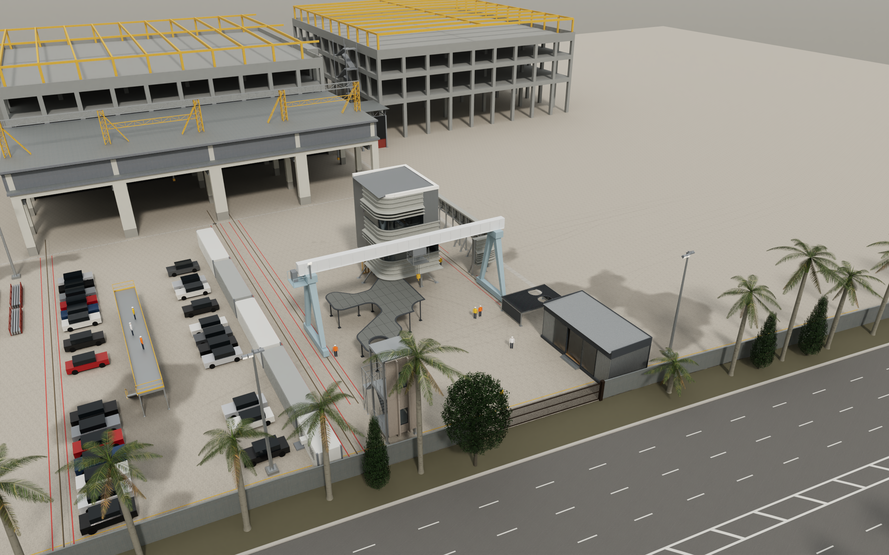

# 幕墙视觉样板场地：完工状态模型



这是一个在浏览器里查看的三维模型。它表现预制构件堆场中的五组幕墙视觉样板（VMU-01 至 VMU-05）全部完工后的状态，其中包括 VMU-01 的雨棚延伸。几何来自 CAD 与加工图数据，所有饰面由同一张色值表驱动。模型可以在网页查看器中实时浏览，也可以输出路径追踪静帧。

## 模型内容

- **样板与场地**：包括 VMU-01 塔楼及其雨棚（既有部分加新增延伸）、弧形的 VMU-03、VMU-02、VMU-04、VMU-05 和 Trellis，以及周围场地：地坪、排水沟、龙门吊轨道与龙门吊、厂房、集装箱、围挡、观景平台和高杆灯；围挡外为通用示意的主路和路边绿化。
- **规模**：7 个 glTF 文件共 2,223,601 个三角面。同一模型另有 Rhino 格式 `model/vmu_site_future.3dm`，单位为毫米，含 236 个对象、245 个图层和 44 个材质。
- **色值表**：`model/materials.json` 定义了 83 个材质。其中 13 个饰面来自色卡和实验室测色，同时记录 SCI 与 SCE 值；渲染采用 SCE 值（不含镜面反射）。按 RAL 指定的饰面保留 RAL 编号：RAL 7005、RAL 7038、RAL 9016。
- **雨棚延伸**：始终以真实饰面显示，顶板为 Mouse Grey，3 mm 件为 T02。查看器可以描边标出延伸范围，但不会改色。

## 运行

需要 Python 3（只用标准库）和支持 WebGL2 的浏览器（Chrome 或 Edge）。启动服务：

```
python serve.py            # 默认端口 18090
```

然后打开 **http://127.0.0.1:18090/index.html**。在 Windows 上也可以直接双击 `start_viewer.bat`。

查看器的主要功能：

- 13 个预设视角。
- 日照按 1.3°N 103.8°E（UTC+8）计算，可自选日期与时间。
- 天空可选阴天或晴间多云（CC0 HDRI）。
- 默认开启 GTAO 与 SMAA。
- 点击构件可查看图层与饰面，另有测距和截图导出。
- “照片级静帧”面板在浏览器内用 three-gpu-pathtracer 进行路径追踪，再由 `serve.py` 调用 Intel Open Image Denoise 降噪。
  - OIDN 需要 numpy 和一个 `OpenImageDenoise.dll`，默认使用 Rhino 8 自带的那份，也可以用环境变量 `OIDN_DLL` 指定其他位置。
  - 没有 OIDN 时，查看器改用浏览器内降噪。
  - 部分集成显卡需要以 `--use-angle=vulkan` 启动 Chrome 或 Edge，路径追踪才能正确出图。

## 渲染图

`renders/` 下共有 16 张 2400×1500 的静帧，另有总览图 `contact_sheet.jpg`：

- 14 张光栅视图，阴天天空；其中图 14 为下午光照。
- 2 张路径追踪静帧，每张 128 spp，经 OIDN 降噪。

渲染图不含 EXIF 或其他文字元数据。

## 精度核对

- **平面位置**：将各单元的平面轮廓与布置图对比，先计算双向最近距离，再做 trimmed ICP 重新配准。
  - 重新配准所需的最大位移为 0.053 m（VMU-04）。
  - 其余单元、雨棚和 Trellis 的位移均不超过 0.031 m。
  - 以上核对在源模型上完成。本仓库中 5 个样板 GLB 的二进制块与源文件逐字节一致；地坪与周边（`site_ground.glb`、`site_context.glb`、`site_features.json`）为公开发布而用 `build/` 中的脚本重新生成（见“局限”）。
- **三角面总数**：7 个 GLB 合计 2,223,601 个三角面，与查看器的载入报告以及 3dm 回读结果一致。
- **色块核对**：用构件 ID 掩膜检查已发布的光栅渲染图，涉及雨棚顶板、压顶、VMU-01 翅片、VMU-04 预制件和木纹铝五类构件。48 个色块全部落在容差范围内。与源渲染图相比，各色块平均色在 L*、a*、b* 上相差不超过 0.15；例外是重新生成的周边（路边树木及其阴影、西侧厂房、龙门吊）改变了掩膜像素的视图 01、07、11（最大为视图 11 中 VMU-04 预制件的 L* 相差 20.7）。
- **相机**：13 个标准视角的相机位置与目标点和源视角相差不超过 0.01 m。

## 局限

- 模型表现的是计划中的完工状态。部分饰面和尺寸仍待现场测量确认；VMU-04 的预制件颜色为示意值。
- `build/` 中的脚本只作为方法记录。它们依赖未包含在本仓库中的保密输入（图纸、CAD 模型、场地测量数据和照片），无法直接运行。
- 只对场地旁的厂房和构筑物建模（依据布置图、场地测量数据和照片），更远的建筑不建模。厂房、通道雨棚、龙门吊、车辆与人物均为近似表达。远景地面为示意纹理，不是实景影像。
- 主路为通用示意：沿测量红线布置的双向分隔道路，尺寸取名义值（每向 4 条 3.5 m 车道、2 m 斜纹标线中央分隔带、4 m 路边绿带），标线为标准样式，路面假定低于场地 0.5 m。路边棕榈与乔木为程序生成的行列，不是实测位置。布置图上没有的第二条龙门吊轨道按照片判读定位。
- 坐标为以场地原点为准的局部坐标（米），不含地理配准。
- 场地地坪、围挡和铁丝网围栏按测量红线布置，保留测量精度；`model/site_features.json` 中只有取整到 1 m 的红线副本，供查看器布置视角。

## 数据与许可

- 第三方组件的许可见 [THIRD_PARTY_LICENSES.md](THIRD_PARTY_LICENSES.md)：
  - three.js、three-mesh-bvh 和 three-gpu-pathtracer 采用 MIT 许可；
  - Poly Haven 和 ambientCG 的纹理与 HDRI 为 CC0；
  - 本仓库不包含 Intel OIDN（Apache-2.0）。
- 本仓库不含任何航拍或地图影像，也不含在航拍影像、在线地图或地形数据上量取的几何或数值；不含来自在线地图的建筑数据、受许可限制的高度数据或实景照片。主路、路边绿化、第二条龙门吊轨道、通道雨棚以及周边构件的颜色均取自图纸、场地测量数据、照片或通用值（见 [build/README.md](build/README.md)）。
- 本仓库中的模型、渲染图、脚本与文档不授予任何许可；除非权利人另行添加 LICENSE 文件，保留所有权利。第三方组件仍按其各自的许可使用。

English: [README.md](README.md)
